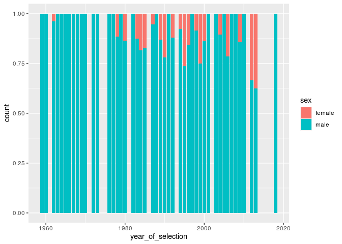

Project proposal
================
Team name

``` r
library(tidyverse)
library(broom)


astronauts <- readr::read_csv('https://raw.githubusercontent.com/rfordatascience/tidytuesday/master/data/2020/2020-07-14/astronauts.csv')
```

## 1\. Introduction

We are going to analysis how the ratio of male to female astronauts has
changed over time in various areas such as country, occupation, military
status, time spent in space and mean total number of missions. The main
characteristic we are going to look is the empoloyment of women over
time in the space industry. This data has come from TidyTuesday from the
Astronaut Database with the data was collected from those who have
travelled to space. There is a variety of data variables collected from
occupation, number of hours in space, number of missions to year and
sex. The main aspect we going to focus on is gender equality in the
space industry and if this has changed over time. This industry is known
for being male dominated and we are going to analyse if there have been
more females employed in the industry overtime.

## 2\. Data

``` r
glimpse(astronauts)
```

    ## Rows: 1,277
    ## Columns: 24
    ## $ id                       <dbl> 1, 2, 3, 4, 5, 6, 7, 8, 9, 10, 11, 12, 13, 1…
    ## $ number                   <dbl> 1, 2, 3, 3, 4, 5, 5, 6, 6, 7, 7, 7, 8, 8, 9,…
    ## $ nationwide_number        <dbl> 1, 2, 1, 1, 2, 2, 2, 4, 4, 3, 3, 3, 4, 4, 5,…
    ## $ name                     <chr> "Gagarin, Yuri", "Titov, Gherman", "Glenn, J…
    ## $ original_name            <chr> "ГАГАРИН Юрий Алексеевич", "ТИТОВ Герман Сте…
    ## $ sex                      <chr> "male", "male", "male", "male", "male", "mal…
    ## $ year_of_birth            <dbl> 1934, 1935, 1921, 1921, 1925, 1929, 1929, 19…
    ## $ nationality              <chr> "U.S.S.R/Russia", "U.S.S.R/Russia", "U.S.", …
    ## $ military_civilian        <chr> "military", "military", "military", "militar…
    ## $ selection                <chr> "TsPK-1", "TsPK-1", "NASA Astronaut Group 1"…
    ## $ year_of_selection        <dbl> 1960, 1960, 1959, 1959, 1959, 1960, 1960, 19…
    ## $ mission_number           <dbl> 1, 1, 1, 2, 1, 1, 2, 1, 2, 1, 2, 3, 1, 2, 1,…
    ## $ total_number_of_missions <dbl> 1, 1, 2, 2, 1, 2, 2, 2, 2, 3, 3, 3, 2, 2, 3,…
    ## $ occupation               <chr> "pilot", "pilot", "pilot", "PSP", "Pilot", "…
    ## $ year_of_mission          <dbl> 1961, 1961, 1962, 1998, 1962, 1962, 1970, 19…
    ## $ mission_title            <chr> "Vostok 1", "Vostok 2", "MA-6", "STS-95", "M…
    ## $ ascend_shuttle           <chr> "Vostok 1", "Vostok 2", "MA-6", "STS-95", "M…
    ## $ in_orbit                 <chr> "Vostok 2", "Vostok 2", "MA-6", "STS-95", "M…
    ## $ descend_shuttle          <chr> "Vostok 3", "Vostok 2", "MA-6", "STS-95", "M…
    ## $ hours_mission            <dbl> 1.77, 25.00, 5.00, 213.00, 5.00, 94.00, 424.…
    ## $ total_hrs_sum            <dbl> 1.77, 25.30, 218.00, 218.00, 5.00, 519.33, 5…
    ## $ field21                  <dbl> 0, 0, 0, 0, 0, 0, 0, 0, 0, 0, 0, 0, 0, 0, 0,…
    ## $ eva_hrs_mission          <dbl> 0.00, 0.00, 0.00, 0.00, 0.00, 0.00, 0.00, 0.…
    ## $ total_eva_hrs            <dbl> 0.00, 0.00, 0.00, 0.00, 0.00, 0.00, 0.00, 0.…

## 3\. Data analysis plan

The outcome will be the variables that we will be looking at
(i.e. occupation, number of missions, military status, time spent in
space etc.). The predictor will be the sex of the astronauts and will
will evaluate this over time.

``` r
astronauts %>%
  ggplot(aes(x = year_of_selection, fill = sex)) + 
  geom_bar()
```

<!-- -->

``` r
astronauts %>%
  ggplot(aes(x = year_of_selection, fill = sex)) + 
  geom_bar(position = "fill")
```

<!-- -->

``` r
astronauts %>%
  summarise(n_distinct(mission_title))
```

    ## # A tibble: 1 x 1
    ##   `n_distinct(mission_title)`
    ##                         <int>
    ## 1                         362
