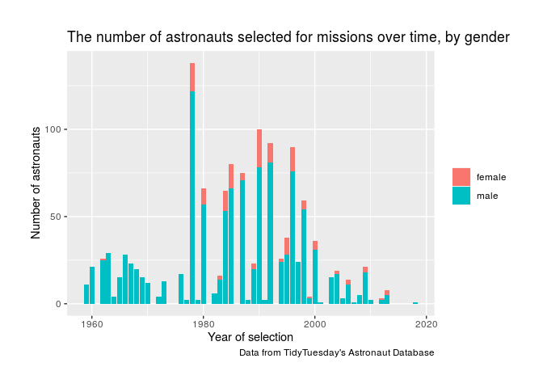

Project proposal
================
The Mousebreakers

``` r
library(tidyverse)
library(broom)


astronauts <- read_csv("/cloud/project/data/astronauts.csv")
```

## 1\. Introduction

As a team, we have decided to use the dataset `astronauts` as we believe
we can construct a meaningful analysis of this data and draw valuable
conclusions. This dataframe contains information about astronauts that
have been on various space expeditions over time, such as their sex,
what year they were selected, what year their mission launched, how long
they spent in space, if they were in the military or a civilian, if they
completed additional missions, and many other variables.

We are going to specifically analyse gender equality among astronauts;
how has the ratio of male to female astronauts changed over time? We’ll
be taking into account factors such as nationality, occupation, military
status, time spent in space and mean total number of missions. The STEM
industry is known for being heavily male dominated; although that is
starting to change, to what extent? Are there certain factors or areas
in which progress is being inhibited, and can these barriers be
overcome? The characteristic we are going to focus our study around is
the employment of women over time in the space industry.

Our data is from TidyTuesday’s Astronaut Database, with the data
collected solely about those who have travelled to space. There exists a
wide variety of data variables available for analysis; we will select
the ones we used carefully, as not all may be relevant to our objective.

## 2\. Data

``` r
glimpse(astronauts)
```

    ## Rows: 1,277
    ## Columns: 24
    ## $ id                       <dbl> 1, 2, 3, 4, 5, 6, 7, 8, 9, 10, 11, 12, 13, 1…
    ## $ number                   <dbl> 1, 2, 3, 3, 4, 5, 5, 6, 6, 7, 7, 7, 8, 8, 9,…
    ## $ nationwide_number        <dbl> 1, 2, 1, 1, 2, 2, 2, 4, 4, 3, 3, 3, 4, 4, 5,…
    ## $ name                     <chr> "Gagarin, Yuri", "Titov, Gherman", "Glenn, J…
    ## $ original_name            <chr> "ГАГАРИН Юрий Алексеевич", "ТИТОВ Герман Сте…
    ## $ sex                      <chr> "male", "male", "male", "male", "male", "mal…
    ## $ year_of_birth            <dbl> 1934, 1935, 1921, 1921, 1925, 1929, 1929, 19…
    ## $ nationality              <chr> "U.S.S.R/Russia", "U.S.S.R/Russia", "U.S.", …
    ## $ military_civilian        <chr> "military", "military", "military", "militar…
    ## $ selection                <chr> "TsPK-1", "TsPK-1", "NASA Astronaut Group 1"…
    ## $ year_of_selection        <dbl> 1960, 1960, 1959, 1959, 1959, 1960, 1960, 19…
    ## $ mission_number           <dbl> 1, 1, 1, 2, 1, 1, 2, 1, 2, 1, 2, 3, 1, 2, 1,…
    ## $ total_number_of_missions <dbl> 1, 1, 2, 2, 1, 2, 2, 2, 2, 3, 3, 3, 2, 2, 3,…
    ## $ occupation               <chr> "pilot", "pilot", "pilot", "PSP", "Pilot", "…
    ## $ year_of_mission          <dbl> 1961, 1961, 1962, 1998, 1962, 1962, 1970, 19…
    ## $ mission_title            <chr> "Vostok 1", "Vostok 2", "MA-6", "STS-95", "M…
    ## $ ascend_shuttle           <chr> "Vostok 1", "Vostok 2", "MA-6", "STS-95", "M…
    ## $ in_orbit                 <chr> "Vostok 2", "Vostok 2", "MA-6", "STS-95", "M…
    ## $ descend_shuttle          <chr> "Vostok 3", "Vostok 2", "MA-6", "STS-95", "M…
    ## $ hours_mission            <dbl> 1.77, 25.00, 5.00, 213.00, 5.00, 94.00, 424.…
    ## $ total_hrs_sum            <dbl> 1.77, 25.30, 218.00, 218.00, 5.00, 519.33, 5…
    ## $ field21                  <dbl> 0, 0, 0, 0, 0, 0, 0, 0, 0, 0, 0, 0, 0, 0, 0,…
    ## $ eva_hrs_mission          <dbl> 0.00, 0.00, 0.00, 0.00, 0.00, 0.00, 0.00, 0.…
    ## $ total_eva_hrs            <dbl> 0.00, 0.00, 0.00, 0.00, 0.00, 0.00, 0.00, 0.…

## 3\. Data analysis plan

The outcome will be the variables that we will be looking at
(i.e. occupation, number of missions, military status, time spent in
space etc.). The predictor will be the sex of the astronauts and we will
evaluate this over time.

``` r
astronauts %>%
  ggplot(aes(x = year_of_selection, fill = sex)) + 
  geom_bar()+
  labs(title = "The number of astronauts selected for missions over time, by gender",
       x = "Year of selection",
       y = "Number of astronauts",
       caption = "Data from TidyTuesday's Astronaut Database")+
  theme(legend.title = element_blank())
```

<!-- -->

``` r
astronauts %>%
  ggplot(aes(x = year_of_selection, fill = sex)) + 
  geom_bar(position = "fill")+
  labs(title = "The proportion of male/female astronauts selected for missions over time",
       x = "Year of selection",
       y = "Percentage of male/female astronauts",
       caption = "Data from TidyTuesday's Astronaut Database")+
  theme(legend.title = element_blank())+
  scale_y_continuous(labels = scales::percent)
```

<!-- -->

``` r
astronauts %>%
  summarise(n_distinct(mission_title))
```

    ## # A tibble: 1 x 1
    ##   `n_distinct(mission_title)`
    ##                         <int>
    ## 1                         362

The total number of missions covered in this data set is 362.

``` r
# mean of total number of missions for male vs female astronauts
astronauts %>%
  group_by(sex) %>%
  summarise(
    mean_n = mean(total_number_of_missions)
  ) 
```

    ## `summarise()` ungrouping output (override with `.groups` argument)

    ## # A tibble: 2 x 2
    ##   sex    mean_n
    ##   <chr>   <dbl>
    ## 1 female   2.99
    ## 2 male     2.98
